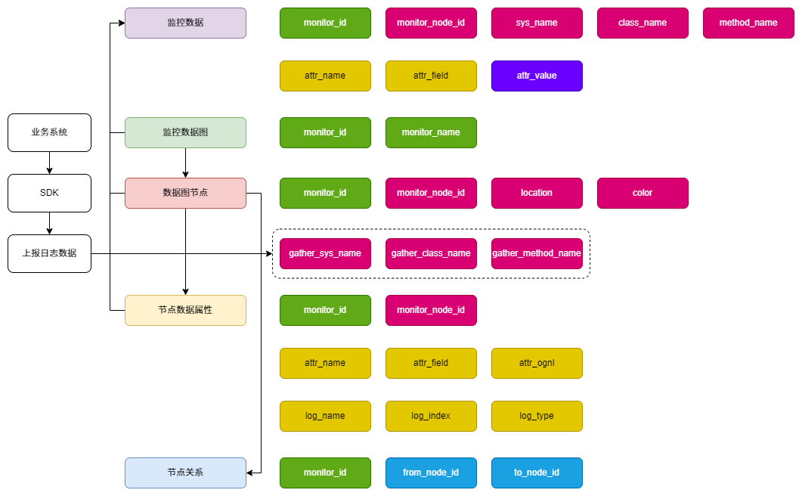
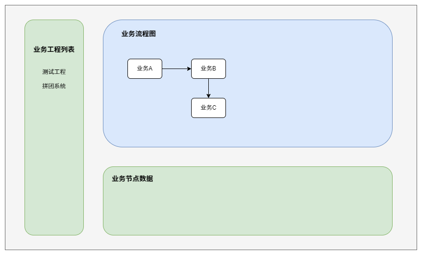
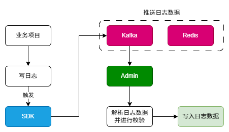

# 透视业务流程 - 监控系统

业务流程监控，以展示用户行为维度的业务流程为核心，项目采用基于扩展 `logback` 日志上报数据进行 `ognl` 配置节点公式的方式进行采集、计算和可视化渲染。

#### 库表设计

节点信息最终存储在监控数据表中，将业务抽象为图这一数据节结构，再用 `GOJS` 组件呈现出来。

#### 页面元素设计

#### 监听日志实现

现阶段为降低项目复杂度，使用 `Redisson` 提供的发布订阅完成日志消息的推送。

